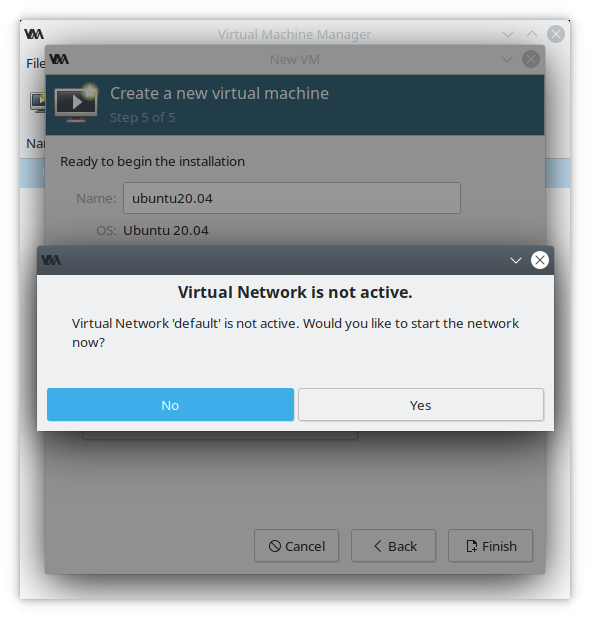

# How to run virt-manager
How to run virt-manager debian
# 1. Installation
Write in terminal "sudo apt install virt-manager qemu-system" then press enter. Enter your password

After that press "y"
After installation finish reboot your computer
# 2. How to create VM
Run virt-manager

Enter your password

Press "Create a new virtual machine"

Then press "Forward"

Press "Browse..."

And then press "Browse Local" and find OS ISO you want to use

Setup RAM and CPU

Create disk

Select "Customize configuration before install"

Activate virtual network

If you want to change some settings you can do this here

Now you can start standard OS installation

